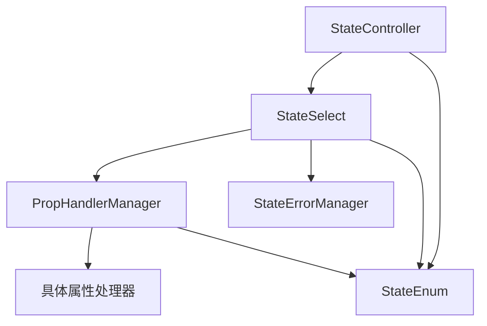

# 🎮 Cocos Creator UI状态控制器系统

> 💡 **灵感来源**  
> 为了实现类似FairyGUI中控制器的效果，参考了[社区讨论](https://forum.cocos.org/t/topic/138330)，并将3.x版本改进为2.x版本，同时加入了诸多新特性。

---

## 📋 文档目录

- [🎯 项目概述](#-项目概述)
- [✨ 核心特性](#-核心特性)
- [🚀 快速开始](#-快速开始)
- [📖 详细使用指南](#-详细使用指南)
- [🔧 版本更新说明](#-版本更新说明)
- [📚 API文档](#-api文档)
- [🔬 高级功能](#-高级功能)
- [🛠️ 故障排除](#️-故障排除)
- [🏗️ 系统架构](#️-系统架构)

---

## 🎯 项目概述

### 💡 设计理念

一个强大且易用的 **Cocos Creator 2.x** UI状态管理系统，让你轻松实现复杂的UI状态切换和属性控制。

### 🎨 适用场景

| 场景类型 | 应用示例 | 效果展示 |
|---------|---------|---------|
| **按钮状态** | 普通/悬浮/按下/禁用 | 颜色、图片、缩放变化 |
| **面板动画** | 展开/收起/淡入/淡出 | 位置、大小、透明度变化 |
| **角色状态** | 健康/受伤/死亡/技能 | 血条、图标、文本变化 |
| **界面布局** | 横屏/竖屏/全屏/窗口 | 位置、锚点、大小变化 |

---

## ✨ 核心特性

### 🌟 主要功能

```
🎯 多状态管理        - 支持无限状态数量，灵活切换
🎨 丰富属性支持      - 15+种UI属性类型，满足各种需求
🔄 智能同步机制      - 三种同步模式，适应不同开发习惯
🚀 控制器承接        - 节点移动时自动迁移状态数据
🛡️ 错误处理系统      - 优雅降级，友好提示
⚡ 性能优化         - 批量更新，内存优化
```

### 🔧 技术亮点

- **模块化架构** - 错误处理、属性处理器分离设计
- **属性处理器系统** - 支持自定义属性类型扩展
- **深度克隆机制** - 确保状态数据完整性
- **智能绑定策略** - 自动识别最佳控制器匹配

---

## 🚀 快速开始

### 📁 第一步：导入文件

将文件夹复制到项目中：

```
assets/script/controller/
├── 📄 StateController.ts      # 状态控制器核心
├── 📄 StateSelect.ts         # 状态选择器
├── 📄 StateEnum.ts          # 枚举定义
├── 📄 StateErrorManager.ts  # 错误处理系统
└── 📄 StatePropHandler.ts   # 属性处理器系统
```

### 🎮 第二步：添加控制器

> 📌 **重要提示**  
> StateController 应该添加到**父节点**上，它会自动管理所有子节点的状态。

1. 在需要状态控制的父节点上添加 `StateController` 组件
2. 在属性面板中设置状态数量和名称
3. 系统会自动创建默认状态："0" 和 "1"

### 🎨 第三步：配置状态选择器

1. 在需要状态变化的**子节点**上添加 `StateSelect` 组件
2. 选择要控制的属性类型（Position、Color、Scale等）
3. 在不同状态下设置不同的属性值
4. 选择合适的同步模式

### ✅ 第四步：测试效果

在编辑器中切换 `StateController` 的 `selectedIndex`，观察子节点属性的变化。

---

## 📖 详细使用指南

### 🎮 StateController（状态控制器）

> 🔧 **核心组件**  
> 负责管理整个状态组，是系统的控制中心。

#### 基本属性

| 属性名 | 类型 | 说明 | 示例值 |
|--------|------|------|--------|
| `ctrlName` | string | 控制器名称（必须唯一） | "MainMenuCtrl" |
| `selectedIndex` | number | 当前选中的状态索引 | 0, 1, 2... |
| `states` | StateValue[] | 状态列表，可动态添加删除 | ["normal", "hover", "pressed"] |
| `previsousIndex` | number | 上一个状态索引（只读） | 0 |

#### 代码控制示例

```typescript
// 🎯 获取控制器组件
let controller = node.getComponent(StateController);

// 🔄 切换到指定状态
controller.selectedIndex = 1;

// 📝 通过状态名称切换
controller.selectedPage = "hover";

// 📊 获取当前状态信息
let currentState = controller.selectedPage;
let previousState = controller.previsousIndex;
```

### 🎨 StateSelect（状态选择器）

> 🎯 **执行组件**  
> 负责具体的状态变化，必须配合 StateController 使用。

#### 支持的属性类型

| 分类 | 属性类型 | 说明 | 值类型 |
|------|----------|------|--------|
| **节点基础** | `Active` | 显示/隐藏 | `boolean` |
| | `Position` | 位置坐标 | `cc.Vec3` |
| | `Euler` | 旋转角度 | `cc.Vec3` |
| | `Scale` | 缩放比例 | `number` |
| | `Anchor` | 锚点位置 | `cc.Vec2` |
| | `Size` | 尺寸大小 | `cc.Size` |
| | `Color` | 节点颜色 | `cc.Color` |
| | `Opacity` | 透明度 | `number` |
| **文本组件** | `Label_String` | 文本内容 | `string` |
| | `LabelOutline_Color` | 文本描边颜色 | `cc.Color` |
| | `Font` | 字体资源 | `cc.Font` |
| **图片组件** | `SpriteFrame` | 图片资源 | `cc.SpriteFrame` |
| **交互组件** | `Slider_Progress` | 滑动条进度 | `number` |
| | `Editbox_String` | 输入框文本 | `string` |
| **特效** | `GrayScale` | 灰度效果 | `boolean` |

#### 🔄 属性同步模式

```typescript
enum SyncMode {
    Independent = 0,  // 🔸 独立模式：每个状态属性完全独立
    AutoSync = 1,     // 🔹 自动同步：添加/删除属性时自动同步到所有状态（推荐）
    ManualSync = 2    // 🔺 手动同步：需要手动点击同步按钮
}
```

> 💡 **推荐设置**  
> 对于大多数情况，建议使用 **AutoSync** 模式，可以大大提高开发效率。

---

## 🔧 版本更新说明

### 🆕 v2.0 新特性对比

相比之前版本，本次更新带来了以下重大改进：

#### 🌟 新增功能

| 功能模块 | 新增内容 | 优势 |
|----------|----------|------|
| **🛡️ 错误处理系统** | StateErrorManager | 优雅降级、友好提示、统一日志 |
| **🔧 属性处理器系统** | StatePropHandler | 模块化设计、易于扩展、类型安全 |
| **🔄 智能同步机制** | 三种同步模式 | 适应不同开发习惯、提高效率 |
| **🚀 控制器承接** | 数据自动迁移 | 节点移动时保持状态数据 |
| **📊 深度克隆** | 完整数据复制 | 确保状态数据完整性和独立性 |

#### 🔧 架构优化

```diff
// 🔹 之前版本
- 单一文件处理所有逻辑
- 手动错误处理
- 属性处理分散在各个方法中

// 🔹 当前版本
+ 模块化架构设计
+ 统一错误处理机制
+ 属性处理器系统
+ 智能同步机制
+ 控制器承接功能
```

#### 🚀 性能提升

- **批量UI更新** - 减少重复渲染，提升性能
- **内存优化** - 更好的内存管理和清理机制
- **智能绑定** - 自动识别最佳控制器匹配

#### 🛡️ 稳定性提升

- **错误处理** - 优雅降级，避免系统崩溃
- **数据完整性** - 深度克隆确保状态数据独立
- **边界检查** - 完善的参数验证机制

---

## 📚 API文档

### 🎮 StateController API

#### 核心属性

```typescript
class StateController {
    // 🏷️ 控制器名称
    get ctrlName(): string;
    set ctrlName(value: string);
    
    // 🎯 当前选中状态索引
    get selectedIndex(): number;
    set selectedIndex(value: number);
    
    // 📋 状态数组
    get states(): StateValue[];
    
    // 📝 通过名称访问状态
    get selectedPage(): string;
    set selectedPage(name: string);
    
    // 📊 上一个状态索引（只读）
    get previsousIndex(): number;
}
```

#### 生命周期方法

```typescript
// 🔄 状态切换时自动调用，通知所有相关的StateSelect组件
private updateState(type: EnumUpdataType, value?: number): void;
```

### 🎨 StateSelect API

#### 核心属性

```typescript
class StateSelect {
    // 🎮 当前选中的控制器ID
    get currCtrlId(): number;
    
    // 🎯 当前控制的属性类型
    get propKey(): EnumPropName;
    set propKey(value: EnumPropName);
    
    // 💎 当前属性值
    get propValue(): TPropValue;
    
    // 🔄 属性同步模式
    syncMode: SyncMode;
    
    // 📊 已修改的属性列表（只读）
    changedProp: string[];
}
```

#### 操作方法

```typescript
// 🔄 手动同步当前属性到所有状态
set syncCurrentProp(value: boolean);

// 🗑️ 删除当前属性
set isDeleteCurr(value: boolean);
```

### 🛡️ 错误处理 API

```typescript
class StateErrorManager {
    // 📝 统一日志输出
    static log(level: ErrorLevel, message: string, context?: IErrorContext): void;
    
    // 🛡️ 优雅降级处理
    static gracefulFallback<T>(operation: () => T, fallbackValue: T, errorMessage?: string): T;
    
    // ✅ 节点有效性验证
    static validateNode(node: cc.Node, context?: IErrorContext): boolean;
    
    // 💬 用户友好的错误提示
    static userFriendlyError(userMessage: string, technicalDetails?: string, context?: IErrorContext): void;
}
```

---

## 🔬 高级功能

### 🔧 自定义属性处理器

如果需要支持新的属性类型，可以按以下步骤扩展：

#### 1️⃣ 添加枚举值

在 `StateEnum.ts` 中添加新的属性类型：

```typescript
export enum EnumPropName {
    // ... 现有属性
    Button_Interactable = 16,  // 🆕 新增：按钮可交互性
}
```

#### 2️⃣ 实现属性处理器

在 `StatePropHandler.ts` 中创建处理器类：

```typescript
class ButtonInteractablePropHandler implements IPropHandler {
    getValue(node: cc.Node) {
        const button = node.getComponent(cc.Button);
        return button ? button.interactable : undefined;
    }
    
    setValue(node: cc.Node, value: TPropValue) {
        const button = node.getComponent(cc.Button);
        if (button) button.interactable = value as boolean;
    }
    
    getDefaultValue(node: cc.Node) {
        return this.getValue(node);
    }
}
```

#### 3️⃣ 注册处理器

```typescript
PropHandlerManager.register(EnumPropName.Button_Interactable, new ButtonInteractablePropHandler());
```

### 🎯 实际应用示例

#### 📱 示例1：按钮状态控制

创建一个带有 normal、hover、pressed 三种状态的按钮：

```
ButtonNode (StateController)
├── 🖼️ Background (StateSelect - SpriteFrame + Color)
├── 🏷️ Label (StateSelect - Label_String + Color)
└── 🎨 Icon (StateSelect - Scale + Opacity)
```

**🔧 配置步骤：**

1. 在 `ButtonNode` 上添加 `StateController`，设置3个状态
2. 在 `Background` 上添加 `StateSelect`：
   - 属性类型选择 `SpriteFrame`，设置不同状态的背景图
   - 再添加一个选择 `Color`，设置不同的背景色调
3. 在 `Label` 上配置文本和颜色变化
4. 在 `Icon` 上配置缩放和透明度变化

#### 📋 示例2：面板展开/收起

创建一个可以展开收起的设置面板：

```
SettingsPanel (StateController)
├── 🎨 Background (StateSelect - Size + Opacity)
├── 🏷️ Title (StateSelect - Position)
├── 📝 Content (StateSelect - Active + Position)
└── ❌ CloseButton (StateSelect - Scale + Opacity)
```

#### 🎮 示例3：角色状态显示

显示角色的不同状态（健康、受伤、死亡）：

```
CharacterUI (StateController)
├── ❤️ HealthBar (StateSelect - Scale + Color)
├── 🛡️ StatusIcon (StateSelect - SpriteFrame)
├── 📛 NameLabel (StateSelect - Color + LabelOutline_Color)
└── 🔢 LevelText (StateSelect - Label_String)
```

---

## 🛠️ 故障排除

### 🔍 常见问题

#### ❓ Q: StateSelect没有反应，状态切换无效果

**可能原因：**
- StateSelect节点不在StateController的子树中
- 属性类型选择错误（如对Label节点选择了Sprite属性）
- 当前控制器ID不匹配

**🔧 解决方法：**

```typescript
// 🔍 检查层级关系
let controller = node.getComponentInParent(StateController);
console.log('找到控制器:', controller ? controller.ctrlName : '未找到');

// 🔍 检查属性匹配
let label = node.getComponent(cc.Label);
if (!label && propKey === EnumPropName.Label_String) {
    console.error('节点没有Label组件，但选择了Label_String属性');
}
```

#### ❓ Q: 切换状态时属性值不正确

**可能原因：**
- 属性值没有在对应状态下设置
- 使用了错误的同步模式
- 存在属性冲突

**🔧 解决方法：**

```typescript
// 🔍 检查属性数据
let stateSelect = node.getComponent(StateSelect);
let propData = stateSelect.getPropData();
console.log('当前状态属性数据:', propData);

// 🔄 重置有问题的属性
stateSelect.isDeleteCurr = true;  // 删除当前属性
// 然后重新设置
```

#### ❓ Q: 控制器承接失败

**可能原因：**
- 节点移动过程中控制器结构发生变化
- 控制器名称冲突
- 数据结构不兼容

**🔧 解决方法：**

```typescript
// 🔄 手动重新绑定控制器
let stateSelect = node.getComponent(StateSelect);
stateSelect.updateCtrlName(node.parent);
```

### 🔍 调试清单

在遇到问题时，按以下清单逐项检查：

- [ ] ✅ StateController和StateSelect的组件添加正确
- [ ] ✅ 节点层级关系符合要求（StateSelect在StateController子树中）
- [ ] ✅ 属性类型与节点组件匹配
- [ ] ✅ 状态数量和索引正确
- [ ] ✅ 控制器名称唯一且有效
- [ ] ✅ 没有循环依赖和冲突
- [ ] ✅ 控制台没有错误日志

---

## 🏗️ 系统架构

### 🔄 核心组件关系



### 📊 数据流向

1. **用户操作** → StateController.selectedIndex
2. **状态通知** → StateController.updateState()
3. **组件更新** → StateSelect.updateState()
4. **属性处理** → PropHandlerManager.setValue()
5. **UI更新** → 具体的节点属性变化

### 🏛️ 设计模式

| 模式 | 应用场景 | 优势 |
|------|----------|------|
| **策略模式** | 属性处理器系统 | 易于扩展新属性类型 |
| **观察者模式** | 状态变化通知机制 | 松耦合的组件通信 |
| **工厂模式** | 属性处理器的创建和管理 | 统一的对象创建接口 |
| **命令模式** | 状态切换操作的封装 | 可撤销的操作支持 |

---

## 🤝 贡献指南

### 🔧 开发环境

- **Cocos Creator**: 2.4.x
- **TypeScript**: 3.x
- **Node.js**: 12+

### 📝 代码规范

#### 命名约定
- 类名使用 `PascalCase`
- 方法和变量使用 `camelCase`
- 常量使用 `UPPER_SNAKE_CASE`
- 私有成员以下划线开头

#### 注释规范
- 关键方法必须有完整的JSDoc注释
- 复杂逻辑需要行内注释说明
- 使用🔧标记重要的技术细节

#### 错误处理
- 使用StateErrorManager统一处理错误
- 提供友好的用户提示
- 关键操作需要优雅降级

### 📥 提交流程

1. Fork 项目并创建特性分支
2. 确保代码通过现有测试
3. 添加新功能的测试用例
4. 更新相关文档
5. 提交 Pull Request

---

## 📄 许可证

本项目采用 **MIT** 许可证，详见 [LICENSE](LICENSE) 文件。

---

## 🙏 致谢

感谢所有为这个项目做出贡献的开发者！

---

## 📅 版本信息

| 项目信息 | 详情 |
|----------|------|
| **🏷️ 当前版本** | v2.0.1 |
| **📅 最后更新** | 2024年12月19日 |
| **🚀 维护状态** | 🟢 积极开发中 |
| **🌟 兼容性** | Cocos Creator 2.x |

---

> 💡 **使用提示**  
> 如果你在使用过程中遇到问题，欢迎提交 Issue 或参与讨论！我们会及时响应并提供帮助。

**Happy Coding! 🎉**
